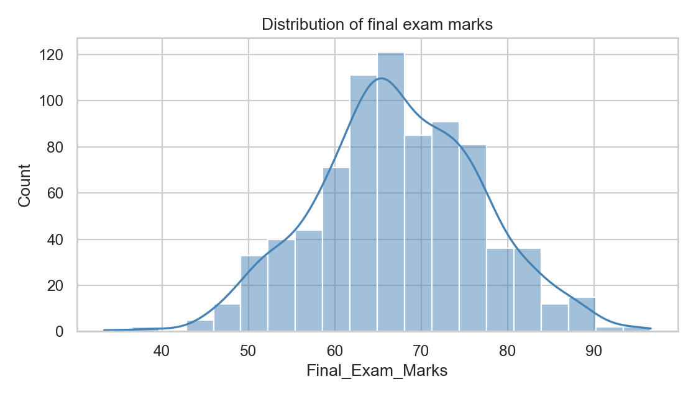
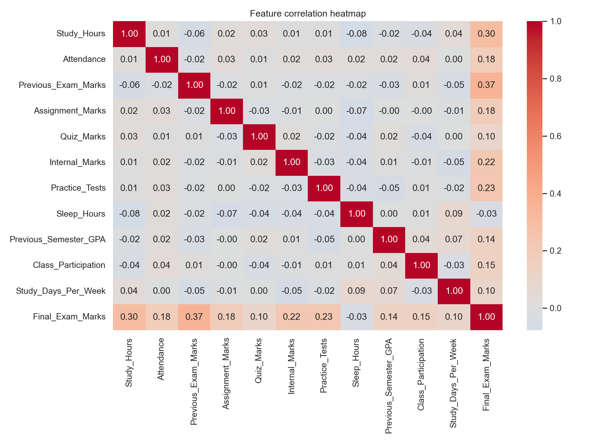
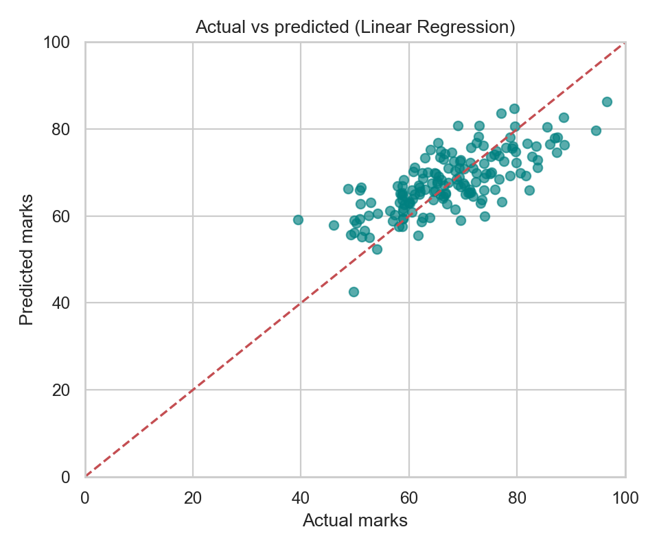
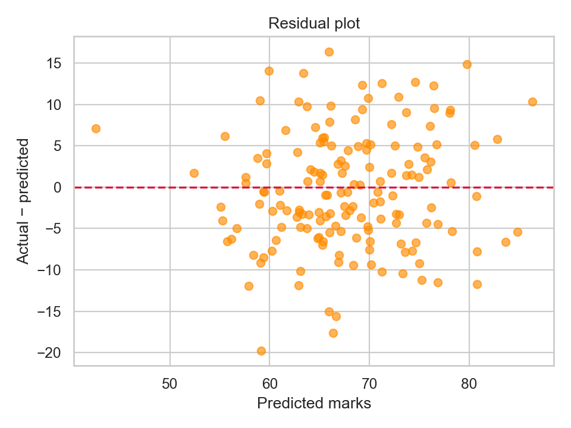
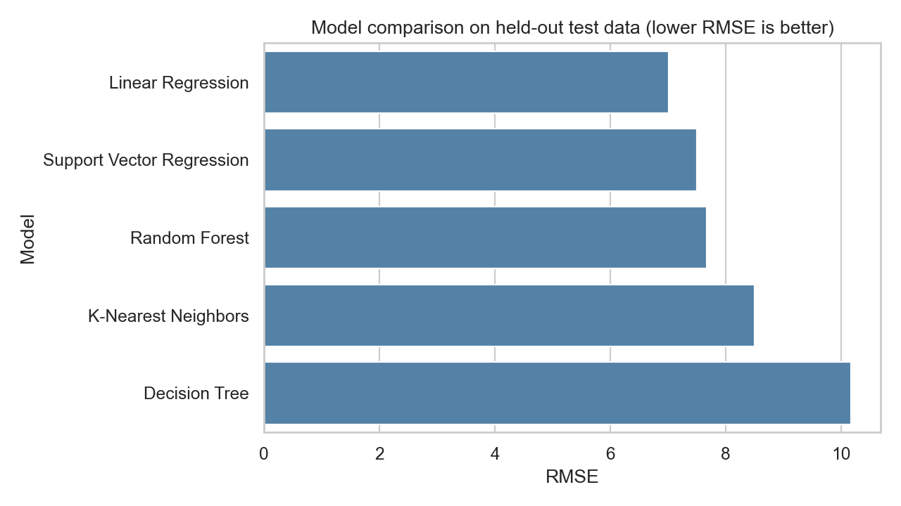
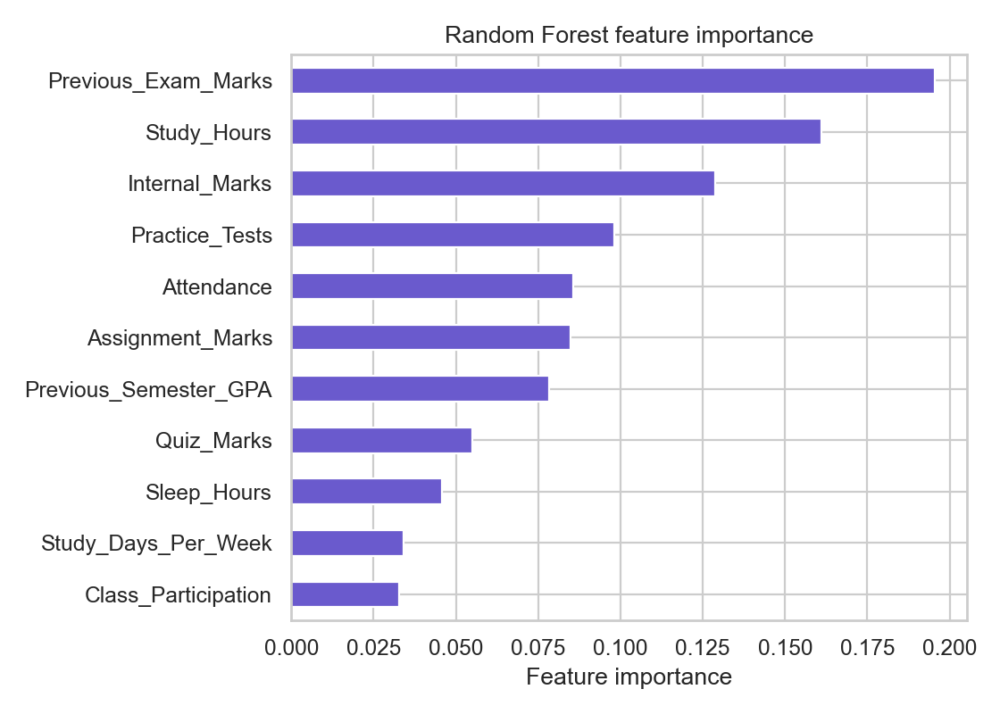

# Exam Marks Prediction Using Machine Learning

## B.Tech CSE (AIML) Minor Project Report

**Student(s):** ____________________  
**Enrollment number(s):** ____________________  
**Department / Institution:** ____________________  
**Project guide:** ____________________  
**Academic year:** ____________________

> Submission note: complete the cover details, run `python train_model.py`, and paste the generated comparison table and notebook charts in Chapter 6. The included data are synthetic; this report does not claim results from real students.

## Project architecture and workflow

```text
Synthetic CSV → Pandas inspection and cleaning → exploratory plots
             → input features / target → reproducible 80:20 split
             → five model pipelines → held-out metric comparison
             → lowest-RMSE model refit for deployment → Streamlit estimate
```

The data, notebook, training program, saved artifact, web interface, and documentation are kept in separate files. The model artifact is a scikit-learn pipeline so preprocessing and prediction stay together.

## Dataset format and feature guide

The CSV has 800 generated records. `Student_ID` is a synthetic identifier and is never a predictor.

| Column | Meaning | Role / range |
|---|---|---|
| Student_ID | Fictional row identifier | Identifier; excluded |
| Study_Hours | Average focused study hours per day | Input; 0.5–10 |
| Attendance | Share of classes attended | Input; percent |
| Previous_Exam_Marks | Earlier exam score | Input; 0–100 |
| Assignment_Marks | Assignment score | Input; 0–100 |
| Quiz_Marks | Quiz score | Input; 0–100 |
| Internal_Marks | Internal assessment score | Input; 0–100 |
| Practice_Tests | Practice tests attempted | Input; count |
| Sleep_Hours | Average sleep hours per night | Input; hours |
| Previous_Semester_GPA | Previous semester GPA | Input; 0–10 |
| Class_Participation | Self/teacher-rated participation level | Input; ordinal 1–5 |
| Study_Days_Per_Week | Days with study activity | Input; 1–7 |
| Final_Exam_Marks | Generated final exam score | **Target**; 0–100 |

These are generated examples, not observations from a public or institutional dataset. Random variation is added to a simple weighted relationship so the models can learn a signal without producing perfect scores. There may still be generator patterns that make validation results look easier than real-world prediction. The dataset is small, synthetic, and lacks subject, cohort, exam difficulty, teaching, health, socioeconomic context, and other factors. It should not support grading, admissions, or interventions.

## Chapter 1 – Introduction

### 1.1 Background

Educational data mining uses data analysis to find patterns in learning and assessment records. A regression model can estimate a numeric outcome such as a mark from earlier indicators. Such an estimate can demonstrate a workflow and prompt reflection, but it cannot explain every student's result or replace teachers' judgment.

### 1.2 Problem statement

It is useful to study whether a collection of previous academic performance and study-habit indicators can estimate a final examination score. The task is to prepare data, compare understandable regression models, and present an estimate in a small interface.

### 1.3 Motivation

This project combines core AIML topics—data cleaning, visualization, feature selection, train/test separation, regression, evaluation, serialization, and deployment—in an explainable student project.

### 1.4 Objectives

1. Create a reproducible, well-documented student-like dataset.
2. Inspect and prepare numeric features using Pandas and scikit-learn.
3. Explore feature/target relationships with visualizations.
4. Compare five regression approaches on one held-out test set.
5. Package the selected pipeline and provide a Streamlit demonstration.
6. Explain model uncertainty and dataset limitations clearly.

### 1.5 Scope

The scope is a local educational demonstration for one generated target. It covers batch training and single-row estimates. It does not connect to student records, predict pass/fail as a classification task, or recommend consequential actions.

## Chapter 2 – Literature Review

Educational data mining research commonly uses prior marks, attendance, assessment activity, and learning-platform records to estimate achievement or identify students who may need support. Reviews describe a range of approaches from linear models and decision trees to ensembles, support vector methods, and neural networks. Alwarthan et al. (2022) review data-mining approaches for higher-education academic performance prediction. Hussain et al. (2021) survey educational data mining methods and comparison issues. These reviews highlight that dataset context, target definition, and validation design affect reported performance; metrics from different datasets are not directly comparable.

This project uses conventional algorithms because they are included in introductory machine-learning curricula and can be compared on tabular numeric data. Linear Regression gives a simple baseline. A Decision Tree learns piecewise rules. Random Forest averages many randomized trees. KNN predicts from nearby training examples. SVR fits a margin-based function, with an RBF kernel allowing nonlinear patterns. The literature motivates comparison, but does not establish in advance which model wins on this generated data.

## Chapter 3 – Methodology

### 3.1 Data collection and understanding

The CSV is generated locally with a fixed pseudo-random seed. Pandas loads it. The notebook displays shape, first and last five rows, types, summary statistics, null counts, and duplicate count. `Student_ID` is for traceability only.

### 3.2 Preprocessing

Exact duplicate rows are removed. Infinite numeric values are changed to missing values. Rows without the target are dropped because there is no outcome to train against. Input missing values are median-imputed inside each model pipeline. The target is constrained to the valid mark range. Values are bounded at entry in the app; the notebook also inspects data ranges. Outlier values are not deleted simply for being unusual: the generator specifies plausible ranges, and arbitrary removal could erase valid students. For real data, source errors should be checked with subject experts.

### 3.3 Exploratory analysis and feature selection

The notebook plots study hours, attendance, previous marks, internal marks, and sleep against final marks; it also plots the target distribution, a correlation heatmap, and feature-wise scatterplots. Correlation is used as an initial linear association check, not proof of causation. All eleven meaningful academic/behavioral input features are retained for the model comparison. The identifier is excluded to avoid learning an arbitrary row number. In a real dataset, feature selection should be validated within training folds and assessed for fairness and usefulness.

### 3.4 Split, scaling, and model training

`train_test_split(test_size=0.20, random_state=42)` produces an 80% training set and 20% test set. All models see the same split. Median imputation is fitted using training data. Linear Regression, KNN, and SVR use StandardScaler because their calculations are affected by feature units. Tree models split by feature thresholds and do not require scaling. Each preprocessor is in a Pipeline to prevent test data from influencing preprocessing.

Five models are compared: Linear Regression, Decision Tree Regressor, Random Forest Regressor, K-Nearest Neighbors Regressor, and Support Vector Regression. After comparison, lowest test RMSE selects the demonstration model. The selected model pipeline is then refitted on all available rows for the app. The reported comparison metrics remain scores from the initial held-out test split; final refitting must not be described as another test evaluation.

## Chapter 4 – System Requirements

### Hardware

- 64-bit laptop/desktop; dual-core processor or better
- 4 GB RAM minimum (8 GB recommended)
- Approximately 200 MB free storage for environment and files
- Internet connection for initial package installation only

### Software

- Windows, macOS, or Linux
- Python 3.10+ compatible with chosen package releases
- Jupyter Notebook or Google Colab for notebook work
- Required libraries listed in `requirements.txt`
- Modern web browser for Streamlit's local interface

## Chapter 5 – Implementation

### 5.1 Training program

`train_model.py` loads the CSV, defines the predictor columns, makes one reproducible train/test split, constructs five pipelines, scores each on the same test rows, and saves the lowest-RMSE pipeline with its feature list and metrics using joblib. Keeping imputation and scaling inside the pipeline prevents preprocessing leakage. The saved dictionary also stores model name and test results so the UI can show evaluation evidence.

Core pattern:

```python
X_train, X_test, y_train, y_test = train_test_split(
    X, y, test_size=0.20, random_state=42
)
pipeline.fit(X_train, y_train)
prediction = pipeline.predict(X_test)
rmse = mean_squared_error(y_test, prediction) ** 0.5
```

### 5.2 Metric definitions

- **MAE (Mean Absolute Error):** average absolute distance between prediction and actual mark. An MAE of 5 means a typical absolute miss of about five marks.
- **MSE (Mean Squared Error):** average squared miss. Large misses receive extra penalty; units are marks squared.
- **RMSE (Root Mean Squared Error):** square root of MSE, so it returns to mark units and still penalizes large misses.
- **R²:** compares model errors to a baseline that predicts the test-set mean. 1 is perfect; 0 is about the mean baseline; below 0 is worse than that baseline.

Lower MAE/MSE/RMSE are preferred. Higher R² is generally preferred. No single metric proves a model is suitable; plots and context matter.

### 5.3 Project files

`dataset/student_exam_data.csv` holds the synthetic records. `notebooks/exam_marks_prediction.ipynb` documents exploration and charts. `train_model.py` trains, evaluates, and serializes. `models/model.pkl` stores the app pipeline; the script also creates `models/metrics.json` and `models/model_comparison.csv`. `app.py` collects values and displays an estimate. `requirements.txt` lists packages. `README.md` documents installation and use. This report records the method and viva answers.

### 5.4 Install and run

```bash
python -m venv .venv
# Windows PowerShell: .venv\Scripts\Activate.ps1
# macOS/Linux: source .venv/bin/activate
python -m pip install -r requirements.txt
python train_model.py
streamlit run app.py
```

For notebook exploration: `jupyter notebook`, then open `notebooks/exam_marks_prediction.ipynb`.

## Chapter 6 – Results and Discussion

The notebook produces a final-mark histogram, scatterplots, a correlation heatmap, actual-versus-predicted marks, residuals, and a model-comparison chart. The training script prints the exact metric table and writes the same values to `models/model_comparison.csv`.

| Model | MAE | MSE | RMSE | R² |
|---|---:|---:|---:|---:|
| Linear Regression | 5.754 | 49.075 | 7.005 | 0.540 |
| Decision Tree | 8.149 | 103.471 | 10.172 | 0.031 |
| Random Forest | 6.245 | 58.766 | 7.666 | 0.449 |
| K-Nearest Neighbors | 6.969 | 72.262 | 8.501 | 0.323 |
| Support Vector Regression | 6.140 | 56.171 | 7.495 | 0.474 |

The lowest test RMSE was 7.005 marks for Linear Regression (MAE 5.754, MSE 49.075, R² 0.540), so the script selected Linear Regression for deployment. Tree-based feature importance is shown for the trained Random Forest; importance is a model-specific measure and does not imply causality. A residual plot should be checked for patterns: a random cloud around zero is more reassuring than curves or changing spread. Because the target was synthesized from related features and noise, these scores show the pipeline working on generated data, not expected accuracy at a college.

### Result figures

The plots below were produced from the same synthetic data and seeded 80:20 split as the training script. Additional feature scatterplots are in `report/figures/`.

**Figure 6.1 – Final mark distribution**



**Figure 6.2 – Correlation heatmap**



**Figure 6.3 – Actual versus predicted marks (Linear Regression)**



**Figure 6.4 – Residual plot**



**Figure 6.5 – Model RMSE comparison**



**Figure 6.6 – Random Forest feature importance**



## Chapter 7 – Application / Interface

The Streamlit page has the project title and description, a form for the eleven predictors, a Predict Exam Marks button, an estimate rounded to one decimal, a performance band, and the model comparison table. Categories are: 0–39 Needs Improvement, 40–59 Average, 60–74 Good, 75–89 Very Good, and 90–100 Excellent. The app displays a clear message that this is an ML-based estimate. The model predicts a numeric score, then the interface clips it to the valid 0–100 range for display. The input controls constrain values to sensible ranges.

## Chapter 8 – Limitations

1. The dataset is synthetic and only 800 rows; it does not represent a real student population.
2. The generated relationship makes a shared signal in training and test records, so metrics can overstate real-world performance.
3. Noise and omitted variables make individual outcomes uncertain.
4. Correlation and feature importance do not show that an input causes a higher mark.
5. A random split may not test generalization to a new institution, course, or year.
6. The app does not provide confidence intervals and is not suitable for high-stakes decisions.
7. Data collection from real students would require consent, privacy controls, data governance, and bias evaluation.

## Chapter 9 – Future Scope

- Evaluate on a larger, consented, representative dataset with clearly defined marks.
- Use cross-validation and split by cohort or time to assess generalization.
- Explore personalized study recommendations and early-warning support with educators.
- Integrate with an ERP/LMS only with access controls and privacy safeguards.
- Add explainable-AI summaries, calibration, and uncertainty ranges.
- Study fairness and whether errors differ across relevant student groups.
- Compare deep learning only when the available data volume and task justify its added complexity.

## Chapter 10 – Conclusion

This minor project demonstrates an end-to-end regression workflow for estimating exam marks: dataset creation, inspection, preprocessing, visualization, model comparison, test-set evaluation, serialization, and a Streamlit front end. It compares five common algorithms using consistent held-out metrics. The interface makes an estimate easy to try while stating that it is not guaranteed. Since the records are synthetic, this is a learning prototype rather than a validated educational assessment tool.

## References

1. Scikit-learn Developers, *scikit-learn User Guide*, https://scikit-learn.org/stable/user_guide.html
2. pandas Development Team, *pandas documentation*, https://pandas.pydata.org/docs/
3. Matplotlib Development Team, *Matplotlib documentation*, https://matplotlib.org/stable/
4. Waskom, M. L., “seaborn: statistical data visualization,” *Journal of Open Source Software*, 6(60), 3021, 2021. https://doi.org/10.21105/joss.03021
5. Alwarthan, S., Aslam, N., and Khan, I. U., “Predicting Student Academic Performance at Higher Education Using Data Mining: A Systematic Review,” *Applied Computational Intelligence and Soft Computing*, 2022. https://doi.org/10.1155/2022/8924028
6. Hussain, S. et al., “Educational Data Mining Techniques for Student Performance Prediction: Method Review and Comparison Analysis,” *Frontiers in Psychology*, 12, 698490, 2021. https://doi.org/10.3389/fpsyg.2021.698490

## Viva Preparation – 35 Questions and Answers

1. **Why did you choose this project?** It lets me apply data preparation, regression, evaluation, and a simple deployment interface to an understandable problem.
2. **What is machine learning?** It is a way to let a computer learn patterns from examples and use them to make predictions.
3. **Why is this a regression problem?** The output is a continuous numeric mark between 0 and 100.
4. **What is the target variable?** `Final_Exam_Marks`, the value the model learns to estimate.
5. **What are features?** Input columns that the model uses, such as attendance and previous marks.
6. **What is feature engineering?** Creating or transforming useful model inputs from available data; here we mostly use the provided fields directly.
7. **Why exclude Student_ID?** It is just an identifier and has no meaningful academic relationship to the score.
8. **Is this real student data?** No. It is synthetic teaching data generated for this project.
9. **Why use train-test split?** To assess the model on rows it did not use to learn its parameters.
10. **Why an 80:20 split?** It leaves most data for training and a useful portion for a final check.
11. **What does random_state do?** It makes the random split repeatable.
12. **Why use Linear Regression?** It is a simple baseline that models a linear relationship and is easy to explain.
13. **Why use a Decision Tree?** It can model nonlinear threshold rules and is easy to visualize.
14. **Why use Random Forest?** It averages many varied trees, which often reduces the instability of a single tree.
15. **What is KNN regression?** It predicts using the average outcomes of nearby training examples.
16. **What is SVR?** Support Vector Regression fits a function while controlling errors within a margin; the RBF kernel can model nonlinear patterns.
17. **Why compare multiple algorithms?** Different models capture different patterns; measurement shows which works best on this test split.
18. **What is overfitting?** A model learns training details too closely and then performs poorly on new data.
19. **What is underfitting?** A model is too simple to capture important patterns, even in training data.
20. **What is MAE?** The average size of the absolute prediction error, in marks.
21. **What is MSE?** The average squared error, which penalizes large misses more.
22. **What is RMSE?** The square root of MSE, expressed in marks and sensitive to large errors.
23. **What is R²?** A score comparing model performance with predicting the test-set average; 1 is ideal, 0 matches that baseline, negative is worse.
24. **Why is R² useful?** It gives a relative goodness-of-fit summary, though it should be read alongside error metrics.
25. **What is data leakage?** Information from test data or the future accidentally influencing training. Pipelines keep imputation/scaling fitted on training data only.
26. **Why scale data?** Scaling puts features on comparable ranges for distance- or margin-based methods like KNN and SVR.
27. **Do trees need scaling?** Usually not, because they use feature thresholds rather than distances.
28. **Why impute missing values?** Many scikit-learn estimators need complete numeric inputs; the median is a simple robust fill value.
29. **How are outliers handled?** We inspect values and use plausible bounds; we do not automatically delete unusual but valid students.
30. **What does the correlation heatmap show?** Pairwise linear association, not cause and effect.
31. **What is feature importance?** A model-specific estimate of how much a feature contributes to tree splits; it is not causal proof.
32. **How does the prediction system work?** It loads the saved pipeline, collects values, arranges them in the trained feature order, predicts a score, and displays a category.
33. **How is the best model selected?** The training script sorts models by held-out RMSE and chooses the lowest value.
34. **What are the limitations?** Synthetic small data, simplified relationships, omitted factors, uncertainty, and limited generalization.
35. **What is the future scope?** Test on ethical real data, validate by cohort, add explainability and uncertainty, and build supportive recommendations.
